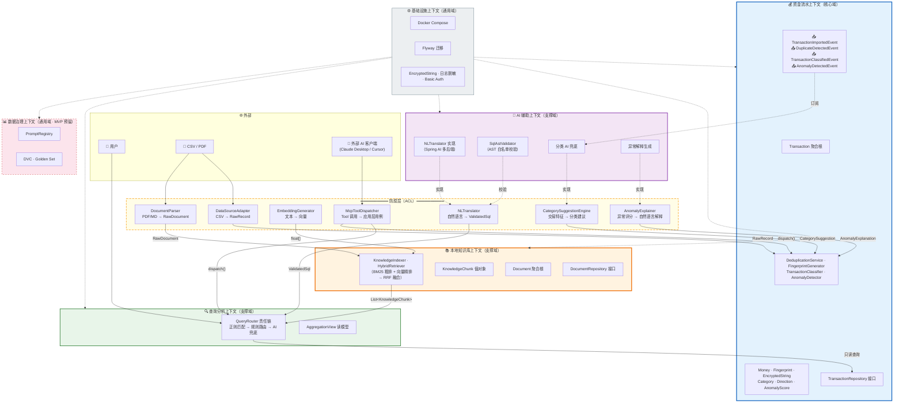

# FinHub — 个人资金数据治理中台

> 基于 DDD 领域模型 + Spring Boot + MyBatis-Plus + AI 的跨平台资金流水聚合工具。

## 限界上下文图



## 各上下文职责边界（一句话）

| 上下文 | 子域类型 | 一句话职责 |
|--------|----------|-----------|
| **💰 资金流水上下文** | 核心域 | **守护 Transaction 聚合根的不变量（金额精度、排重指纹、分类一致性），所有资金数据的唯一写入入口。** |
| **📚 本地知识库上下文** | 支撑域 | **管理 Document 聚合根的生命周期（上传→分块→Embedding→检索），为查询提供财务制度/历史凭证的语义上下文，不参与资金流水写入。** |
| **🧠 AI 辅助上下文** | 支撑域 | **通过 ACL 向其他上下文提供 NL→SQL 翻译、分类兜底、异常解释等 AI 能力，自身不持有业务数据，只做"翻译+建议"不做"决策"。** |
| **🔍 查询分析上下文** | 支撑域 | **责任链路由查询请求（正则→规则→AI→知识库），以只读方式聚合资金流水 + 知识库结果，绝不修改聚合根。** |
| **📊 数据治理上下文** | 通用域 | **管理 Prompt 模板/Golden Set/DVC 版本化，确保 AI 行为可追溯、可评估、可复现（MVP 预留包结构）。** |
| **⚙️ 基础设施上下文** | 通用域 | **提供 Docker 编排、Flyway 迁移、AES 加密、日志脱敏、Basic Auth 等横切能力，不包含任何业务规则。** |

## 关键边界规则

```
┌─────────────────────────────────────────────────────────┐
│  🚫 红线：资金流水上下文 ←/→ 本地知识库上下文            │
│     二者不允许直接依赖，必须通过 AI 辅助上下文或         │
│     查询分析上下文间接协作                               │
├─────────────────────────────────────────────────────────┤
│  ✅ 资金流水 → 领域事件 → AI 辅助（分类兜底）           │
│  ✅ 本地知识库 → 检索结果 → 查询分析（RAG 增强）        │
│  ✅ 查询分析 → 只读 Repository → 资金流水（聚合查询）   │
│  ✅ 所有外部依赖（CSV/LLM/PDF）只能通过 ACL 进入上下文  │
└─────────────────────────────────────────────────────────┘
```

## 设计说明

### 1. ACL 防腐层大框是逻辑视图，非物理集中

图中把所有 ACL 接口画在一个大框里是为了**视觉上快速定位"哪些地方有防腐层"**。物理上：

| 防腐层接口 | 物理位置 | 说明 |
|-----------|----------|------|
| `DataSourceAdapter` | `fundflow/acl/` | 资金流水上下文定义，核心域不认识 CSV |
| `NLTranslator` | `ai/acl/` | AI 辅助上下文定义，隔离 LLM 技术细节 |
| `CategorySuggestionEngine` | `ai/acl/` | AI 辅助上下文定义，分类建议不直接耦合模型 |
| `AnomalyExplainer` | `ai/acl/` | AI 辅助上下文定义，异常解释不依赖具体模型 |
| `DocumentParser` | `knowledge/acl/` | 本地知识库上下文定义，隔离 PDF/MD 解析库 |
| `EmbeddingGenerator` | `knowledge/acl/` | 本地知识库上下文定义，隔离向量生成技术 |
| `McpToolDispatcher` | `infra/mcp/` | 基础设施上下文，MCP 协议适配（非业务 ACL） |

> 每个上下文只定义自己需要的防腐接口，实现由上游上下文或基础设施层提供。ACL 是**分散的接口包**，不是集中式层。

### 2. 查询分析 → 资金流水 Repository：MVP 的客户-供应商模式

图中 `q_router --> ff_repo` 是跨上下文直接依赖 Repository 接口，严格 DDD 中应通过只读防腐层隔离。MVP 阶段简化为：

> "查询分析上下文通过资金流水上下文暴露的只读 Repository 接口获取数据，这是**客户-供应商关系中的遵奉者模式**。未来演进为 CQRS 时，会拆分为独立的读模型投影（TransactionSummaryView），避免跨上下文对聚合根内部结构的耦合。"

### 3. MCP Dispatcher 归属：基础设施协议适配

`McpToolDispatcher` 放在 ACL 大框中是因为它直接面向外部 AI 客户端，在边界视图中属于最外层。但物理上它位于 `infra/mcp/` 包，本质是**基础设施层对 MCP 协议的适配**（类似 HTTP Controller 对 REST 的适配），通过调用应用层服务完成请求路由，不包含业务逻辑。

---

## 开发进度

### Day 1 — 项目骨架 + ADR
- Maven 多模块骨架、Docker Compose（MySQL + Redis）、Flyway 迁移目录
- 6 篇 ADR（Money 精度、ACL 防腐层、AI 校验、Repository 模式、安全基线、Docker 容器化）
- 统一语言词汇表、Claude Code 协作规范

### Day 2 — 核心域值对象 + Transaction 聚合根
- **值对象**：`Money`（精度截断/币种白名单/日志脱敏）、`Category`（收支兼容性校验）、`Direction`、`Fingerprint`（SHA256 + 盐值）、`EncryptedString`（AES-256-CBC 加解密）、`AnomalyScore`、`CategorySuggestion`
- **聚合根**：`Transaction`（`createFrom` 工厂方法校验 6 条不变量 + `markClassified`/`markAnomaly` 状态变更 + 领域事件收集）
- **领域事件**：`TransactionImportedEvent`、`DuplicateDetectedEvent`、`TransactionClassifiedEvent`、`AnomalyDetectedEvent`
- **测试**：98 个测试覆盖全部值对象与聚合根

### Day 3 — 领域服务 + 防腐层 + 应用层编排
- **领域服务接口**（Javadoc 完整）：`DeduplicationService`（三重防重）、`TransactionClassifier`（规则→历史→AI）、`AnomalyDetector`（金额/重复/订阅异常）、`FingerprintGenerator`（结构化哈希五步算法）
- **ACL 防腐层**：`DataSourceAdapter` + `RawRecord`（字段级注释，明确可空语义）
- **应用层**：`IngestionAppService` 空壳骨架（构造器注入 + `importFile()` + `ImportResult` DTO）
- **基础设施实现**：`DeduplicationServiceImpl`（external_id → fingerprint → Caffeine 缓存三重防重链，批次内去重 + DB 查重，日志脱敏输出）
- **测试**：`DeduplicationServiceTest` 契约测试（abstract）+ `DeduplicationServiceImplTest` 实现测试（Mock Repository + 真实 Caffeine）

### Day 4（待做）— 参考 `docs/superpowers/specs/day03执行计划.md`
- `FingerprintGeneratorImpl`：SHA256 结构化哈希实现
- `TransactionClassifierImpl`：规则引擎（商户关键词映射）
- `AnomalyDetectorImpl`：统计规则异常检测（MVP 版）
- `AlipayCSVAdapter` / `WechatCSVAdapter`：防腐层实现
- 应用层 `importFile()` 编排流程实现